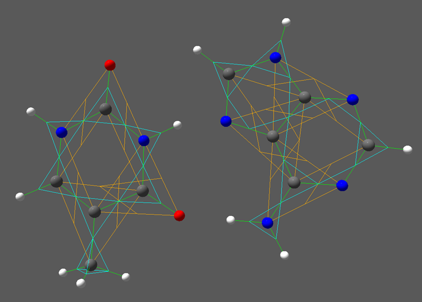

.. _bonded_interactions:

.. py:currentmodule:: tissue_forge

Bonded Interactions
--------------------

    Tissue Forge models of thymine (left) and adenine (right) molecules
    using bonded interactions.

A bonded interaction is an interaction due to a *bond* between
a group of particles. A bond describes an interaction exclusively
between the group of particles using a :ref:`potential <potentials>`.
Tissue Forge currently supports :ref:`bond <bonded_interactions:Bonds>`
and bond-like :ref:`angle <bonded_interactions:Angles>` and
:ref:`dihedral <bonded_interactions:Dihedrals>`.
To optimize simulation performance, bonds are visualized with simple lines by default.
However, three-dimensional visualization of bonded interactions can be enabled using
the :ref:`rendering interface<rendering_bonds>`.

.. _bonds:

Bonds
^^^^^^

A bond describes an interaction between two particles in terms
of the distance between the two particles. A bond can be
created using the method :py:meth:`create <Bond.create>` on the class
:py:class:`Bond`, which returns a handle to the newly created bond.
A bond can be manually destroyed using the :py:class:`BondHandle`
method :py:meth:`destroy <BondHandle.destroy>`.

.. rst-class::  clear-both

.. code-block:: python

    import tissue_forge as tf
    # Create a bond between particles "p0" and "p1" using the potential "pot_bond"
    bond_handle = tf.Bond.create(pot_bond, p0, p1)

:py:class:`Bond` instances have an optional dissociation energy
that, when set, describes an energy threshold above which the
bond is automatically destroyed. Likewise, each :py:class:`Bond`
instance has an optional half life that, when set, describes
the probability of destroying the bond at each simulation step,
which Tissue Forge automatically implements,

.. code-block:: python

    bond_handle.dissociation_energy = 1E-3
    bond_handle.half_life = 10.0

All bonds in the universe are accessible using the :py:attr:`Universe`
property :py:attr:`bonds <Universe.bonds>`,

.. code-block:: python

    all_bonds = tf.Universe.bonds  # Get updated list of all bonds

A bond is rendered as a line joining the two particles of the bond.

.. _angles:

Angles
^^^^^^^

.. image:: angle.png
   :alt: Left floating image
   :class: with-shadow float-left
   :height: 125px

An angle describes an interaction between two particles in terms
of the angle made by their relative position vectors with respect
to a third particle. An angle can be created using the method
:py:meth:`create <Angle.create>` on the class :py:class:`Angle`,
which returns a handle to the newly created angle. An angle can be
manually destroyed using the :py:class:`AngleHandle` method
:py:meth:`destroy <AngleHandle.destroy>`. :py:class:`Angle` instances
have analogous properties and methods to most of those defined for :py:class:`Bond`
instances, including accessing each constituent particle
by indexing, and optional dissociation energy and half life.
All angles in the universe are accessible using the :py:attr:`Universe`
property :py:meth:`angles <Universe.angles>`,

.. rst-class::  clear-both

.. code-block:: python

    # Create a bond between particles "p0" and "p2" w.r.t.
    #   particle "p1" using the potential "pot_ang"
    angle_handle = tf.Angle.create(pot_ang, p0, p1, p2)
    all_angles = tf.Universe.angles  # Get updated list of all angles

An angle is rendered as a line joining the center particle and each end
particle, and a line joining the midpoint of those two lines.

.. _dihedrals:

Dihedrals
^^^^^^^^^^

.. image:: dihedral.png
   :alt: Left floating image
   :class: with-shadow float-left
   :height: 157px

A dihedral describes an interaction between four particles in terms
of the angle between the planes made by their relative position vectors.
A dihedral can be created using the method :py:meth:`create <Dihedral.create>`
on the class :py:class:`Dihedral`, which returns a handle
to the newly created dihedral. A dihedral can be manually destroyed using
the :py:class:`DihedralHandle` method :py:meth:`destroy <DihedralHandle.destroy>`.
:py:class:`Dihedral` instances have analogous properties and methods to most
of those defined for :py:class:`Bond` instances, including accessing each
constituent particle by indexing, and optional dissociation energy and half life.
All dihedrals in the universe are accessible using the :py:attr:`Universe`
property :py:meth:`dihedrals <Universe.dihedrals>`,

.. rst-class::  clear-both

.. code-block:: python

    # Create a bond between the plane made by particles "p0", "p1" and "p2"
    #   and the plane made by particles "p1", "p2" and "p3"
    #   using the potential "pot_dih"
    dihedral_handle = tf.Dihedral.create(pot_dih, p0, p1, p2, p3)
    all_dihedrals = tf.Universe.dihedrals  # Get updated list of all dihedrals

A dihedral is rendered as a line joining the first and second particles, a
line joining the third and fourth particles, and a line joining the midpoint
of those two lines.
