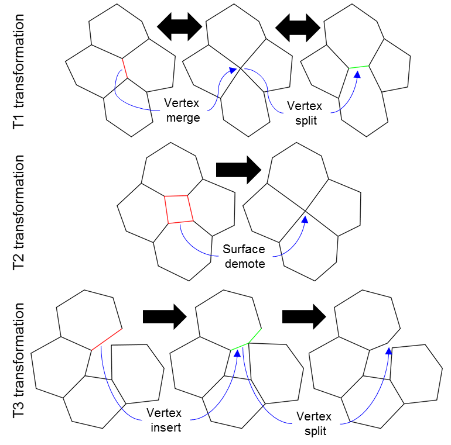
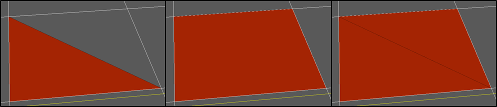
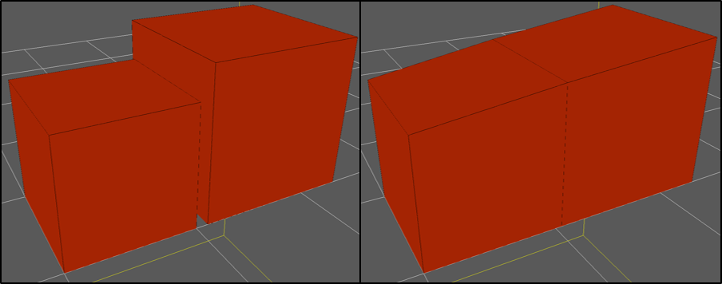
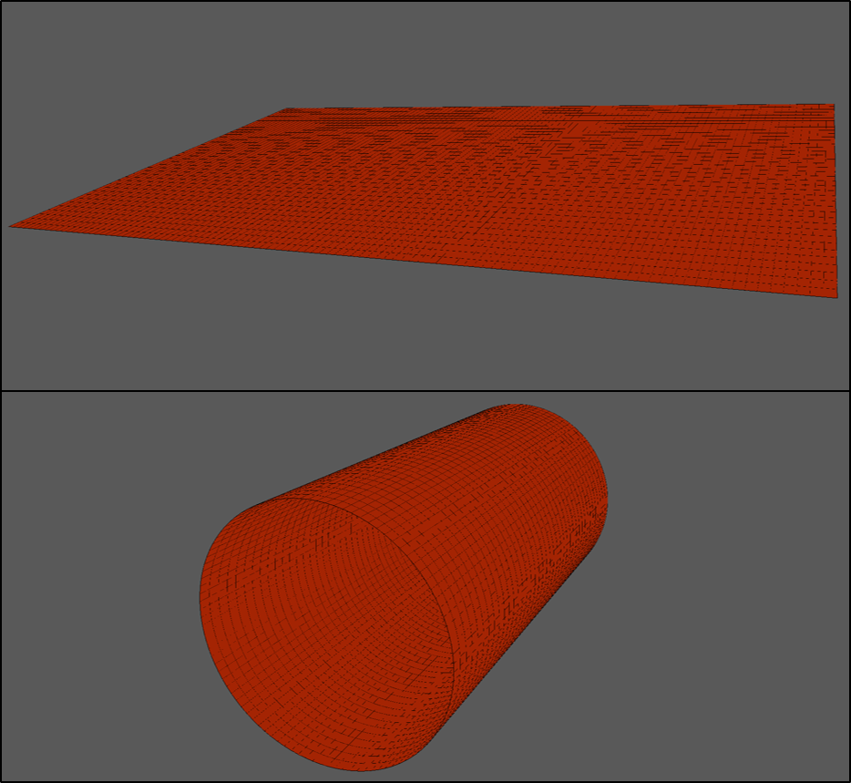
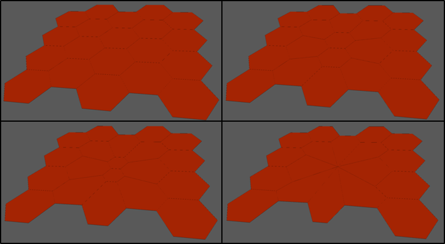
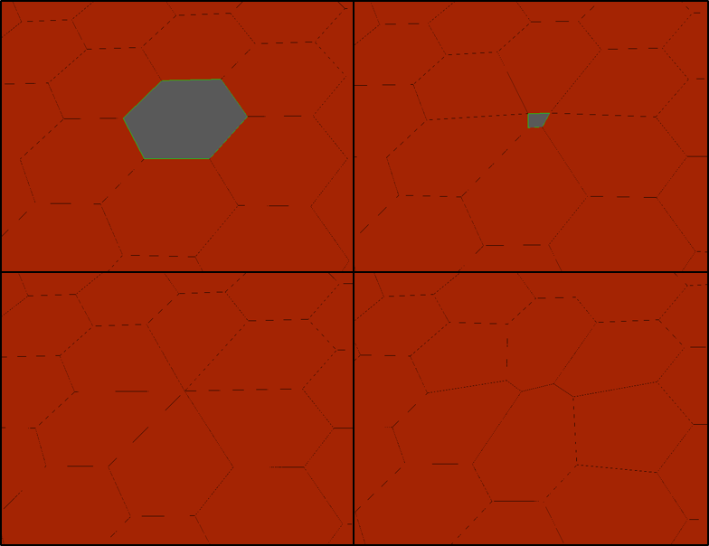

.. _vertex_solver:

.. py:currentmodule:: tissue_forge.models.vertex.solver

Vertex Model Solver
^^^^^^^^^^^^^^^^^^^^

The vertex model solver implements the vertex model formalism for modeling biological objects
as topologically connected :ref:`vertices <api_vertex_solver_vertex>` in a mesh.
Each vertex is constructed from a Tissue Forge :ref:`particle <creating_particles_and_types>`.
A set of vertices can define a :ref:`surface <api_vertex_solver_surface>`
for two-dimensional modeling,
and a set of surfaces can define a :ref:`body <api_vertex_solver_body>` for
three-dimensional modeling.
Dynamical models are deployed in simulation by creating :ref:`actors <api_vertex_solver_actors>`
that implement various property and/or process models and :ref:`binding <api_vertex_solver_mesh_bind>`
them to individual surfaces and/or bodies or their type.

The vertex model solver acts as a subengine along with the rest of Tissue Forge.
During each simulation step, the vertex model solver translates vertex model specification
and the configuration of a mesh into forces on underlying Tissue Forge particles
for integration using :ref:`overdamped mechanics <making_things_move>`.
After Tissue Forge updates the trajectory of all particles (here vertices),
the vertex model solver implements topological transformations, called
*quality operations*, that allow a mesh to adapt its topology according to various
kinetic and kinematic criteria.
Finally, the vertex model solver uses Tissue Forge module support for
mesh :ref:`rendering <rendering>` and integrating with
:ref:`logging <logging_and_errors>` and :ref:`file I/O <file_io>` support.
The vertex model solver fully supports custom model specification and simulation events
through the :ref:`Tissue Forge event system <events>`, including mesh object
creation, manipulation and destruction.

Each surface is defined by an ordered set of vertices, and each body is defined by an
unordered set of connected surfaces.
A surface is defined by at least three vertices, and
a body is defined by at least four surfaces.
The order of the vertices of a surface defines the orientation of the surface normal
using the right-hand rule.
Each vertex can define an arbitrary number of surfaces,
and each surface can, at most, define two bodies.
The vertex model solver provides no explicit representation of edges,
as they are implicitly defined by the ordered sets of surface vertices.
Surfaces are weakly constrained to be flat and convex.

The vertex model solver resolves all vertex model properties and processes, whether they be
defined for a surface or body, into properties and processes on the vertices.
For example, when defining a force that acts uniformely on the volume of a body,
the vertex model solver produces equivalent forces that act on the vertices of the body.
As such, while bodies and surfaces naturally have properties like volume and area,
respectively, vertices also have measures of mass, area, volume, etc., that depend
on the objects that they define.
The vertex model solver accomplishes such relationships up and down the hierarchy of objects
in a mesh by considering each surface as consisting of a triangulation according to
its vertices, where each vertex contributes to two triangles, and all triangles
share a point at the centroid of the surface. Each vertex is assumed to contribute
to half of the area of each triangle that it defines, and so the area of a vertex
is equal to half of the area of all triangles that it defines. Likewise, each vertex
is assumed to contribute a volume to a body proportionally to the area of the body that
the vertex defines, and so the volume of a vertex is equal to its contribution to all
bodies that it defines.

The vertex model solver provides flexible specification and deployment of models representing
object properties and processes through objects called :ref:`actors <api_vertex_solver_actors>`.
Like the Tissue Forge :ref:`potential <potentials>`, an actor is an object that
implements a model, and that can be applied to mesh objects by instance or by type.
Some actors are only applicable to a particular type of object
(*e.g.*, :class:`NormalStress` for surfaces), and some actors are applicable to both
two- and three-dimensional objects (*e.g.*, :class:`SurfaceAreaConstraint`).
An arbitrary set of actors can be applied to any combination of instances or types by
:ref:`binding <api_vertex_solver_mesh_bind>` in the :ref:`typical way <binding>`, except that
successive calls to binding for the vertex model solver are additive.
While applying two potentials to a particle type requires binding one potential object
that is the sum of the two potentials, two actors can instead be bound to a mesh object
by simply binding each actor in successive calls.

Currently, the vertex model solver provides the following actors that operate on surfaces,

* :class:`Adhesion`: Models adhesion between pairs of surface instances by type
* :class:`ConvexPolygonConstraint` (automatically applied): Imposes that surfaces are convex
* :class:`EdgeTension`: Models tension between connected vertices
* :class:`FlatSurfaceConstraint` (automatically applied): Imposes that surfaces are flat
* :class:`NormalStress`: Models a stress acting on a surface along its normal
* :class:`SurfaceAreaConstraint`: Imposes a surface area constraint
* :class:`SurfaceTraction`: Models a traction force

The vertex model solver provides the following actors that operate on bodies,

* :class:`Adhesion`: Models adhesion between pairs of body instances by type
* :class:`BodyForce`: Imposes a body force
* :class:`SurfaceAreaConstraint`: Imposes a surface area constraint
* :class:`VolumeConstraint`: Imposes a volume constraint

For details on each actor, refer to the
:ref:`Vertex Model Solver API Reference <api_vertex_solver>`.

The vertex model solver implements quality operations to allow for an automatically
dynamic mesh topology. In general, quality operations enforce rules that promote
the quality of a mesh, whether kinematically (*e.g.*, no surfaces that are too small)
or kinetically (*e.g.*, inserting a vertex to better distribute forces).
Current development of the Tissue Forge vertex model solver has primarily targeted
quality operations for two-dimensional simulation, and dynamic three-dimensional
vertex model meshes are presently an active field of research.

Currently the vertex model solver supports the following quality operations,

* *Body demote*: a body becomes a vertex when its volume is less than a threshold
* *Edge split*: a vertex becomes two vertices when the length of the resulting edge will increase
* *Surface demote*: a surface becomes a vertex when its area is less than a threshold
* *Vertex insert*: a vertex is inserted between two vertices of a surface when it penetrates the perimeter of the surface
* *Vertex merge*: two vertices are merged into one vertex when separated by a distance less than a threshold

    Examples of automatic mesh quality operations in two-dimensional simulation.
    Vertices are merged when they are too close ("Vertex merge") and a vertex
    splits if the resulting edge is predicted to grow ("Vertex split", top row).
    A surface becomes a vertex if its area is too small ("Surface demote", middle row).
    Two surfaces collide if a vertex from a surface penetrates the perimeter of a
    nearby surface ("Vertex insert", bottom row).
    Quality operations on bodies demote a body to a vertex when the volume of the
    body is too small ("Body demote").
    T1 and T3 transformations are completely reversible by automatic mesh quality operations, whereas
    T2 transformations can be reversed by replacing a vertex with a surface.

In Python, all functionality of the vertex model solver module can be accessed from the
:mod:`solver <tissue_forge.models.vertex.solver>` module (``models::vertex`` namespace in C++), ::

    from tissue_forge.models.vertex import solver as tfv

In C++, the module can be included when building from source with

.. code-block:: cpp

    #include <models/vertex/solver/tfVertexSolver.h>

Before using any functionality of the module and after initialization of Tissue Forge,
the module method :meth:`init` must be called, ::

    import tissue_forge as tf
    tf.init()
    tfv.init()

Like the Tissue Forge :ref:`particle type <particle_types>`, the vertex model solver
provides type-based specification of :ref:`surfaces <api_vertex_solver_surface>`
and :ref:`bodies <api_vertex_solver_body>` and their creation through
surface and body types, respectively.
Each surface and body is an instance of a surface and body type, respectively,
and each surface and body type is a subclass of :class:`SurfaceType` and :class:`BodyType`,
respectively.
Surface and body types are dynamic model definitions that can be used to accomplish various
tasks like creating or retrieving instances. In Python, a surface type can easily be created
by deriving from :class:`SurfaceTypeSpec` (and likewise from :class:`BodyTypeSpec` for a body type),
which has class attributes that, when set, automatically
:ref:`bind <api_vertex_solving_mesh_bind>` corresponding :ref:`actors <api_vertex_solver_actors>`
to the type during registration, ::

    class CellType(tfv.SurfaceTypeSpec):
        """
        A surface type that models two-dimensional cells with a surface area constraint
        """
        # Surface area constraint
        surface_area_val = 1.0  # Constraint value
        surface_area_lam = 1.0  # Target area value

A new surface type can be simultaneously instantiated and registered
with the vertex model solver in Python with the class method :meth:`SurfaceTypeSpec.get`, ::

    cell_type: tfv.SurfaceType = CellType.get()  # Get the type

The vertex model solver provides a number of ways to create mesh objects.
:class:`SurfaceType` instances can act as a factory that creates
:class:`Surface` instances of their type when passed a list of positions in
proper winding order for where to create the vertices that define the surface, ::

    # Create a triangular cell
    cell_0 = cell_type(positions=[
        tf.Universe.center,
        tf.Universe.center + tf.FVector3(1, 0, 0),
        tf.Universe.center + tf.FVector3(0, 1, 0)
    ])

Mesh objects provide methods to modify both the topology and shape of objects in the mesh, ::

    # Make the cell a square by inserting a new vertex
    #   Get the vertices along the +x and +y directions
    v1 = cell_0.find_vertex(dir=tf.FVector3(1, 0, 0))
    v2 = cell_0.find_vertex(dir=tf.FVector3(0, 1, 0))
    #   Create and insert a new vertex
    #   The new vertex is implicitly added to the surface
    v3 = tfv.Vertex.insert_c(pos=tf.Universe.center + tf.FVector3(1, 1, 0), v1=v2, v2=v2)

Mesh objects also provide their own methods for creating new mesh objects, like
splitting a surface into two surfaces, ::

    # Split the square cell into two triangular cells
    cell_1 = cell_0.split(v1, v2)

    Creating a simple triangular surface (left),
    inserting a vertex to transform the triangle into a square (middle), and
    splitting the square surface into two triangular surfaces (right).

:class:`BodyType` instances can also act as factories for creating :class:`Body`
instances, and can be conveniently specified in Python by deriving from :class:`BodyTypeSpec`, ::

    class CellBodyType(tfv.BodyTypeSpec):
        """A cell type with a volume constraint"""
        # Volume constraint
        volume_lam = 1.0  # Constraint value
        volume_val = 1.0  # Target volume value

    cell_type: tfv.BodyType = CellBodyType.get()  # Get the type

A Body can be constructed by passing a set of connected surfaces to a body type.
The created body will be an instance of the type with properties that correspond
to the shape and topology of the surfaces, ::

    class CellSurfaceType(tfv.SurfaceTypeSpec):
        """A cell surface type"""

    cell_surface_type: tfv.SurfaceType = CellSurfaceType.get()  # Get the surface type

    # Create the surfaces for a cubic body of dimension 1
    box_dim = 1
    #   Define the relative position of each vertex
    relative_positions = [
        tf.FVector3(0, 0, 0),                    # Vertex 0
        tf.FVector3(0, box_dim, 0),              # Vertex 1
        tf.FVector3(box_dim, box_dim, 0),        # Vertex 2
        tf.FVector3(box_dim, 0, 0),              # Vertex 3
        tf.FVector3(0, 0, box_dim),              # Vertex 4
        tf.FVector3(box_dim, 0, box_dim),        # Vertex 5
        tf.FVector3(box_dim, box_dim, box_dim),  # Vertex 6
        tf.FVector3(0, box_dim, box_dim)         # Vertex 7
    ]
    #   Define a vertex winding order so that all normals face outward
    surface_vertex_indices = [
        (0, 3, 2, 1),  # Bottom
        (4, 5, 6, 7),  # Top
        (3, 2, 6, 5),  # Right
        (0, 4, 7, 1),  # Left
        (0, 3, 5, 4),  # Front
        (1, 2, 6, 7)   # Back
    ]
    o = tf.Universe.center  # Choose an origin for Vertex 0
    #   Create the surfaces
    surfs_0 = []
    for svi in surface_vertex_indices:
        surfs_0.append(cell_surface_type(positions=[o + relative_positions[i] for i in svi]))
    tfv.Surface.sew(surfs=surfs_0)  # Connect the surfaces according to nearby vertices
    body_0 = cell_type(surfs_0)     # Create the body

Methods that modify the topology of the mesh are also respected by bodies, such as making
two bodies in contact by making them share a surface, ::

    # Create a bigger cubic body and make it in contact with the first body
    o = tf.Universe.center + tf.FVector3(box_dim + 0.1, 0, 0)  # Choose a new origin for Vertex 0
    #   Create the surfaces
    surfs_1 = []
    for svi in surface_vertex_indices:
        surfs_1.append(cell_surface_type(positions=[o + relative_positions[i] * 1.25 for i in svi]))
    tfv.Surface.sew(surfs=surfs_1)  # Connect the surfaces
    body_1 = cell_type(surfs_1)     # Create another body
    #   Find the nearest surfaces and merge them into a shared surface
    surf_merge_0 = body_0.find_surface(tf.FVector3(1, 0, 0))
    surf_merge_1 = body_1.find_surface(tf.FVector3(-1, 0, 0))
    surf_merge_0.merge(surf_merge_1, [0.5] * len(surf_merge_0.vertices))  # Merge into a shared surface

    Creating two simple cubic bodies (top)
    and putting them in contact by making a shared surface (bottom).

The vertex model solver provides generators to quickly construct simple two-dimensional and
three-dimensional meshes of mesh objects. For example, a sheet of quadrilaterals can be generated
with all surfaces appropriately connected, which can be subsequently transformed to build a
cylinder, ::

    import tissue_forge as tf
    from tissue_forge.models.vertex import solver as tfv
    import numpy as np
    # Do initializations
    tf.init(dim=[15, 10, 10])
    tfv.init()
    # Declare cylinder parameters
    cyl_radius = 2                          # Radius of the cylinder
    cyl_len = 8                             # Length of the cylinder
    num_radius = 100                        # No. cells along the perimeter of the cylinder
    num_len = 40                            # No. cells along the length of the cylinder
    cyl_circum = 2 * np.pi * cyl_radius     # Cylinder circumference
    dim_circum = cyl_circum / num_radius    # Cell length along the perimeter of the cylinder
    dim_len = cyl_len / num_len             # Cell length along the length of the cylinder
    # Create and get a surface type
    class CellType(tfv.SurfaceTypeSpec):
        """A 2D cell type"""
    cell_type: tfv.SurfaceType = CellType.get()  # Get the type
    # Create a sheet of quadrilateral surfaces
    start_pos = (tf.Universe.dim - tf.FVector3(cyl_circum, cyl_len, 0)) * 0.5
    surfs = tfv.create_quad_mesh(cell_type, start_pos, num_radius, num_len, dim_circum, dim_len)

The vertices of each surface can be directly manipulated
to roll the sheet into a cylinder, ::

    # Roll the sheet into a cylinder
    #   First, gather all vertices in an array that reflects the sheet topology
    verts = []
    for i in range(num_radius):
        verts.append([])
        [verts[-1].append(surfs[i][j].find_vertex(dir=tf.FVector3(-1, -1, 0))) for j in range(num_len)]
        verts[-1].append(surfs[i][-1].find_vertex(dir=tf.FVector3(-1, 1, 0)))
    verts.append([])
    [verts[-1].append(surfs[-1][j].find_vertex(dir=tf.FVector3(1, -1, 0)))]
    verts[-1].append(surfs[-1][-1].find_vertex(dir=tf.FVector3(1, 1, 0)))
    #   Transform vertex coordinates into cylindrical coordinates
    for i, vi in enumerate(verts):
        ang = -2 * np.pi * i / num_radius
        x_coord = tf.Universe.center[0] + cyl_radius * np.sin(ang)
        z_coord = tf.Universe.center[2] + cyl_radius * np.cos(ang)
        for vj in vi:
            vj.position = tf.FVector3(x_coord, vj.position[1], z_coord)
    #   Sew the seam
    [tfv.Surface.sew(s1=surfs[0][j], s2=surfs[-1][j]) for j in range(num_len)]

    Generating a sheet of quadrilateral surfaces (top)
    and transforming the sheet into a tube (bottom).

The vertex model solver also supports constructing mesh objects using data in
:ref:`3D model formats <file_io>`.
A body can be constructed from a :py:class:`Mesh3DF <tissue_forge.io.Mesh3DF>` instance, and
a surface can be constructed from a :py:class:`Face3DF <tissue_forge.io.Face3DF>` instance, ::

    # Import a two-dimensional mesh from a 3DF
    obj_struct: tf.io.ThreeDFStructure = tf.io.fromFile3DF('my_blender_mesh2d.obj')
    # Build a two-dimensional cell for each imported face
    for f in obj_struct.faces:
        cell_type(f)
    # Verify each newly created vertex position
    for s in cell_type:
        for v in s.vertices:
            print(f'Vertex {v.id}: {v.position}')

Mesh objects provide methods for conveniently finding other objects according to their neighborhood
and topology. For example, a vertex that defines a surface can be retrieved from the surface
by looking in a particular direction with respect to the centroid of the surface, ::

    tf.init(dim=[3, 3, 2])
    tfv.init()
    class MySurfaceType(tfv.SurfaceTypeSpec):
        pass
    surface_type = MySurfaceType.get()
    # Place a unit square starting at the origin
    surf_0 = surface_type(positions=[
        tf.FVector3(0, 0, 0),
        tf.FVector3(1, 0, 0),
        tf.FVector3(1, 1, 0),
        tf.FVector3(0, 1, 0)
    ])
    # Get the top-right vertex
    vert_topright = surf_0.find_vertex(dir=tf.FVector3(1, 1, 0))
    print('Vertex position:', vert_topright.position)  # Returns [1, 1, 0]

Mesh objects also provide properties on demand according to their topology, like the area
of a vertex (calculated as the area contribution to all surfaces defined by the vertex), ::

    print('Vertex surface area:', vert_topright.area)      # Prints 0.25 (1/4 of one unit square)
    # Place a second, adjacent surface
    vert_botright = surf_0.find_vertex(dir=tf.FVector3(1, -1, 0))
    new_vert0 = tfv.Vertex.create(tf.FVector3(2, 0, 0))
    new_vert1 = tfv.Vertex.create(tf.FVector3(2, 1, 0))
    surf_1 = surface_type([vert_botright, new_vert0, new_vert1, vert_topright])
    print('Vertex surface area:', vert_topright.area)      # Prints 0.5 (1/4 of two unit squares)

While in Python the :class:`SurfaceTypeSpec` and :class:`BodyTypeSpec` classes provide
class attributes that indicate :ref:`actors <api_vertex_solver_actors>` for their types,
in general, actors can be instantiated and :ref:`bound <vertex_solver_mesh_bind>` to
surfaces, surface types, bodies and body types at any time during simulation.
For example, a sheet of two-dimensional, hexagonal cells can all be modeled with a
surface area constraint according to their type, but also with a few cells
that also experience tension in their edges, ::

    # Do imports and initializations
    import tissue_forge as tf
    from tissue_forge.models.vertex import solver as tfv
    tf.init()
    tfv.init()
    # Build a 5x4 sheet of hexagonal cells centered at the origin
    #   Declare a cell type
    hex_radius = 1.0
    class CellType(tfv.SurfaceTypeSpec):
        """A two-dimensional cell type"""
        # Surface area constraint
        surface_area_val = 3 / 2 * np.sqrt(3) * hex_radius * hex_radius
        surface_area_lam = 1.0
    cell_type = CellType.get()  # Get the type
    #   Build the sheet
    num_surfs_x, num_surfs_y = 5, 4
    start_pos_x = (num_surfs_x + 1) / 2
    start_pos_y = (num_surfs_y + 3) * np.cos(np.pi / 3) * np.cos(np.pi / 6)
    start_pos = tf.Universe.center - tf.FVector3(start_pos_x, start_pos_y, 0) * hex_radius
    surfs = tfv.create_hex2d_mesh(cell_type, start_pos, num_surfs_x, num_surfs_y, hex_radius)
    # Bind edge tension to a few surfaces
    edge_tension = tfv.EdgeTension(lam=1.5)
    [tfv.bind.surface(edge_tension, s) for s in surfs[2][1:3]]

Actors typically have public members that allow dynamic control of their model parameters
during simulation, changes to which are instantaneously applied. ::

    # Collapse the surfaces
    edge_tension.lam = 2.0

    Generating a sheet of hexagonal surfaces (top left),
    applying edge tension to four surfaces (top right),
    and increasing the edge tension during simulation (bottom left),
    resulting in the surfaces collapsing into a vertex (bottom right).

Adhesion is one of a special type of actor that uses two surface or body types in its definition.
An :class:`Adhesion` instance can be bound to a pair of types using :func:`bind.types`, or
in Python using the class attribute ``adhesion``, which is a dictionary specifying an adhesion value
with other types by name, ::

    class StickyCellType(tfv.SurfaceTypeSpec):
        """A two-dimensional cell type that aggregates by adhesion"""
        adhesion = {
            'StickyCellType': -1,  # Present in this simulation
            'LonelyCellType': 10   # Not present in this simulation, not a problem
        }
    sticky_cell_type = StickyCellType.get()
    tfv.SurfaceTypeSpec.bind_adhesion([StickyCellType])  # Binds for whichever types are registered

Many modeling features from Tissue Forge can also be applied in vertex models.
Since each vertex of the vertex model solver has an underlying particle,
:ref:`forces <forces>` can be applied to all vertices by type. ::

    # Give all vertices some noise
    vertex_type = tfv.MeshParticleType_get()  # Get the vertex particle type
    rf = tf.Force.random(0.1, 0)              # Create some noise
    tf.bind.force(rf, vertex_type)            # Bind noise to the vertex particles

Access to the underlying particle type of all vertices also allows easy setup for
two-dimensional simulation, ::

    # Do 2D simulation in the x-y plane
    vertex_type.frozen_z = True

Likewise, the underlying particle of each vertex can be accessed to
create :ref:`bonds <bonded_interactions>`. ::

    # Make an edge of a surface contractile
    surf: tfv.SurfaceHandle
    vertex_0, vertex_1 = surf.vertices[0:2]
    contractile_pot = tf.Potential.linear(k=1)
    tf.Bond.create(contractile_pot, vertex_0.particle(), vertex_1.particle())

When two vertices are merged during mesh quality operations, any bonds connected to one, but
not both, vertices is automatically transferred to the remaining vertex. Bonds connected to
both vertices are destroyed.

    Simulating contractility during wound healing using bonds (top left).
    When an automatic topological transformation merges two vertices, all
    bonds connected to the destroyed vertex are transfered to the remaining
    vertex (top right), while all bonds connected to both vertices
    are destroyed (bottom row).

To support vertex modeling at a wide range of resolutions, all
:ref:`mesh quality operations <api_vertex_solver_meshquality>` can be customized
to adjust how topological transformations occur, or completely disabled. ::

    # Modify some details of mesh quality operations
    mesh: tfv.Mesh = tfv.MeshSolver.get_mesh()  # The mesh has the quality object
    mesh.quality.vertex_merge_distance = 0.1    # Distance below which two vertices merge
    mesh.quality.edge_split_distance = 0.2      # Distance between two vertices after a vertex splits
    # Or, disable all operations
    mesh.quality = None

The vertex model solver provides access to a stream of information about what
mesh quality operations occur during a simulation step. A log of operations
can be generated by forwarding vertex model solver logging to the
:ref:`Tissue Forge Logger <logging_and_errors>`. Vertex model solver logging can be
forwarded at a specified logging level, enabled and disabled at any time
during simulation. ::

    tf.Logger.enableConsoleLogging(tf.Logger.ERROR)
    tfv.Logger.setForwardLogging(True)
    tfv.Logger.setLogLevel(tf.Logger.INFORMATION)

.. note::

    The vertex model solver module currently does not support :ref:`GPU acceleration <cuda>`.
