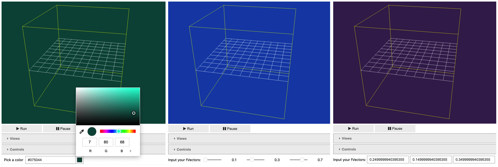
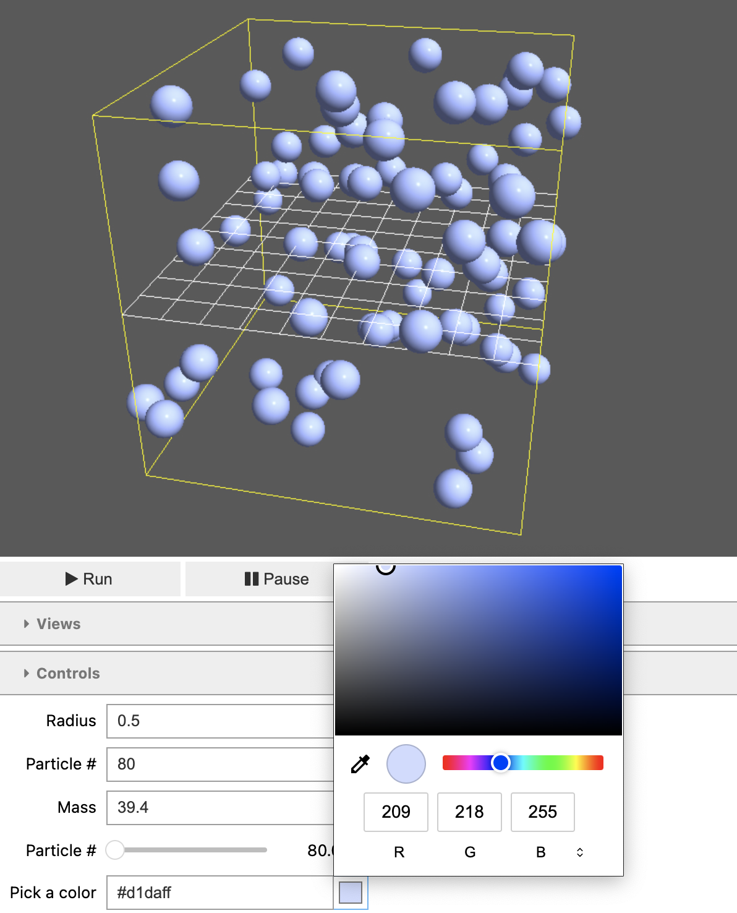

.. _jupyterwidgets:

.. py:currentmodule:: tissue_forge.notebook
    

Jupyter Notebook Widgets
-----------------------------
Tissue Forge supports Jupyter Notebook simulations with interactive widgets. 
Users can dynamically adjust background, grid, and border colors, as well as particle radius, mass, number, and color. 
To capture and preserve their simulation environment, Tissue Forge provides save and screenshot widget functionalities.
All built-in methods are provided
in the :doc:`notebook <docs_api_py:api_notebook>` module.

.. _backgroundcolorchangertools:

Background Color Changer Tools
^^^^^^^^^^^^^^^^^^^^^^^^^^^^^^

    Tissue Forge models demonstrating user ability to modify background color using a color palette, text box, and slider.

Tissue Forge supports three different widgets to change the background color of simulations run in Jupyter Notebook environments, depending on the user's preferences. 
Should the user wish to change the background color using a color palette, a color palette can be called using the method :meth:`set_background_picker`.
Should the user instead wish to change the background color using a slider or text box, a these tools can be called using the methods :meth:`set_background_slider` and :meth:`set_background_text`, respectively.
Currently, these background color changer tools cannot be linked by default. This feature is expected to become available in upcoming Tissue Forge releases.

.. code-block:: python

    import tissue_forge as tf
    # Create and show the Jupyter widget to modify the background color using a color picker
    tf.notebook.set_background_picker(show=True)

    # Create and show the Jupyter widget to modify the background color using sliders
    tf.notebook.set_background_slider(show=True)

    # Create a Jupyter widget to modify the background color using text boxes and constraint permissible colors
    tf.notebook.set_background_text(show=True, field_kwargs={0: dict(min=0.5)})

.. _gridcolorchangertools:
|

Grid Color Changer Tools
^^^^^^^^^^^^^^^^^^^^^^^^
Tissue Forge supports three different widgets to change the grid color of simulations run in Jupyter Notebook environments, depending on the user's preferences. 
Should the user wish to change the grid color using a color palette, a color palette can be called using the method :meth:`set_grid_picker`.
Should the user instead wish to change the grid color using a slider or text box, a these tools can be called using the methods :meth:`set_grid_slider` and :meth:`set_grid_text`, respectively.
Currently, these grid color changer tools cannot be linked by default. This feature is expected to become available in upcoming Tissue Forge releases.

.. code-block:: python

    # Create and show a Jupyter widget to modify the grid color using a color picker
    tf.notebook.set_grid_picker(show=True)

    # Create and show a Jupyter widget to modify the grid color using sliders
    tf.notebook.set_grid_slider(show=True)

    # Create a Jupyter widget to modify the grid color using text boxes
    box, widget = tf.notebook.set_grid_text()

.. _bordercolorchangertools:

|

Border Color Changer Tools
^^^^^^^^^^^^^^^^^^^^^^^^^^^^
Tissue Forge supports three different widgets to change the grid color of simulations run in Jupyter Notebook environments, depending on the user's preferences. 
Should the user wish to change the grid color using a color palette, a color palette can be called using the method :meth:`set_borders_picker`.
Should the user instead wish to change the grid color using a slider or text box, a these tools can be called using the methods :meth:`set_borders_slider` and :meth:`set_borders_text`, respectively.
Currently, these grid color changer tools cannot be linked by default. This feature is expected to become available in upcoming Tissue Forge releases.

.. code-block:: python

    # Create and show a Jupyter widget to modify the color of the borders using a color picker
    tf.notebook.set_borders_picker(show=True)

    # Create and show a Jupyter widget to modify the color of the borders using sliders
    tf.notebook.set_borders_slider(show=True)

    # Create and show a Jupyter widget to modify the color of the borders using text boxes
    tf.notebook.set_borders_text(show=True)

.. _particlemodifierwidgets:

|

Particle Modifier Widgets
^^^^^^^^^^^^^^^^^^^^^^^^^

    Tissue Forge models demonstrating user ability to modify particle radius, mass, number, and color.
    
Tissue Forge supports widgets that allow to change the radius, mass, particle number, and particle color in their simulation.
A number of widgets can be created, integrated and shown for controlling particle attributes
(*e.g.*, :func:`set_ptype_color_picker` to control color with a color picker)
and
number by type (*e.g.*, :func:`set_ptype_number_text` to control the number of particles with a text box).

.. code-block:: python

    ptype: tf.ParticleType

    # Create and show a widget to modify the color of a particle type and its particles
    tf.notebook.set_ptype_color_picker(ptype, show=True)

    # Create and show a widget to modify the mass of a particle type and its particles
    tf.notebook.set_ptype_mass_slider(ptype, show=True)

    # Create and show a widget to control the number of particles of a type with constraints
    tf.notebook.set_ptype_number_text(ptype, show=True, min=500, max=1000)

    # Create and show a widget to modify the radius of a particle type and its particles with constraints
    tf.notebook.set_ptype_radius_slider(ptype, show=True, min=ptype.radius / 2, max=ptype.radius * 2)

.. _simulationsaverandschreenshottools:

|

Simulation Saver and Screenshot Tools
^^^^^^^^^^^^^^^^^^^^^^^^^^^^^^^^^^^^^

.. figure:: tf_save.png
    :width: 100%
    :alt: Tissue Forge save widget demonstration
    :align: center
    :figclass: align-center

    Tissue Forge save widget demonstration.

Tissue Forge supports Jupyter widgets to save Tissue Forge simulations and capture screenshots within a Jupyter Notebook environment.
Should the user wish to save a simulation, this widget can be called using the method :meth:`save_widget`.
Should the user wish to screenshot a simulation, this widget can be called using the method :meth:`screenshot_widget`. 
Once called, save and screenshot buttons populate, allowing the user to name their file and specify the desired location.

.. code-block:: python

    # Create and show a Jupyter widget to save Tissue Forge simulations
    tf.notebook.save_widget()

    # Create and show a Jupyter widget to screenshot Tissue Forge simulations
    tf.notebook.screenshot_widget()
