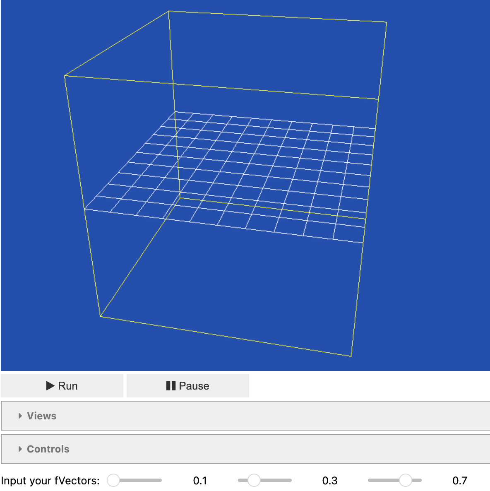
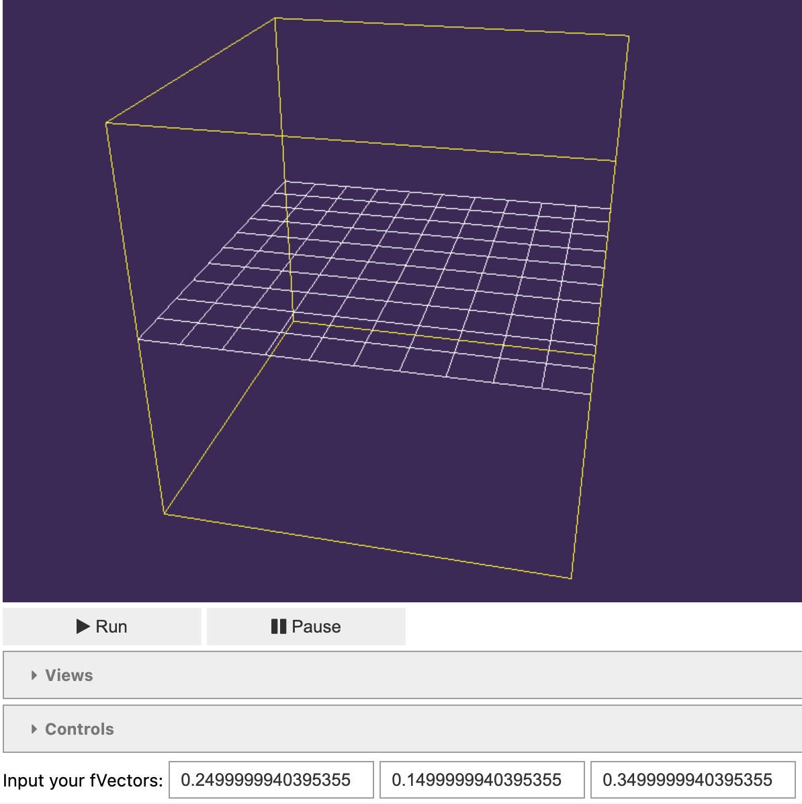

.. _jupyterwidgets:

.. py:currentmodule:: tissue_forge
    

Tissue Forge Jupyter Widgets
-----------------------------
Tissue Forge supports Jupyter Notebook simulations with interactive widgets. 
Users can dynamically adjust background, grid, and border colors, as well as particle radius, mass, number, and color. 
To capture and preserve their simulation environment, Tissue Forge provides save and screenshot widget functionalities.

.. _backgroundcolorchangertools:

Background Color Changer Tools
^^^^^^^^^^^^^^^^^^^^^^^^^^^^^^
.. image:: background_colorpalette.png
    :width: 30%
    :alt: Color palette for background color

.. raw:: html

  

    Tissue Forge models demonstrating user ability to modify background color using a color palette, f-vector text box, and f-vector slider.
  

Tissue Forge supports three different widgets to change the background color of simulations run in Jupyter Notebook environments, depending on the user's preferences. 
Should the user wish to change the background color using a color palette, a color palette can be called using the method :meth:`colorPicker_set_background`. 
Should the user instead wish to change the background color using a f-vector slider or f-vector text box, a these tools can be called using the methods :meth:`fvectorSlider_set_background` and :meth:`fvectorText_set_background`, respectively.
Currently, these background color changer tools cannot be linked by default. This feature is expected to become available in upcoming Tissue Forge releases.

.. code-block:: python

    import tissue_forge as tf
    #Call the Jupyter widget to modify the background color using a color picker
    tf.notebook.colorPicker_set_background()

    #Call the Jupyter widget to modify the background color using f-vector sliders
    tf.notebook.fvectorSlider_set_background()

    #Call the Jupyter widget to modify the background color using f-vector text entry boxes
    tf.notebook.fvectorText_set_background()

.. _gridcolorchangertools:
|

Grid Color Changer Tools
^^^^^^^^^^^^^^^^^^^^^^^^
Tissue Forge supports three different widgets to change the grid color of simulations run in Jupyter Notebook environments, depending on the user's preferences. 
Should the user wish to change the grid color using a color palette, a color palette can be called using the method :meth:`colorPicker_set_grid`. 
Should the user instead wish to change the grid color using a f-vector slider or f-vector text box, a these tools can be called using the methods :meth:`fvectorSlider_set_grid` and :meth:`fvectorText_set_grid`, respectively.
Currently, these grid color changer tools cannot be linked by default. This feature is expected to become available in upcoming Tissue Forge releases.

.. code-block:: python

    import tissue_forge as tf
    #Call the Jupyter widget to modify the grid color using a color picker
    tf.notebook.colorPicker_set_grid()

    #Call the Jupyter widget to modify the grid color using f-vector sliders
    tf.notebook.fvectorSlider_set_grid()

    #Call the Jupyter widget to modify the grid color using f-vector text entry boxes
    tf.notebook.fvectorText_set_grid()

.. _boardercolorchangertools:

|

Boarder Color Changer Tools
^^^^^^^^^^^^^^^^^^^^^^^^^^^^
Tissue Forge supports three different widgets to change the grid color of simulations run in Jupyter Notebook environments, depending on the user's preferences. 
Should the user wish to change the grid color using a color palette, a color palette can be called using the method :meth:`colorPicker_set_boarders`. 
Should the user instead wish to change the grid color using a f-vector slider or f-vector text box, a these tools can be called using the methods :meth:`fvectorSlider_set_boarders` and :meth:`fvectorText_set_boarders`, respectively.
Currently, these grid color changer tools cannot be linked by default. This feature is expected to become available in upcoming Tissue Forge releases.

.. code-block:: python

    import tissue_forge as tf
    #Call the Jupyter widget to modify the color of the borders using a color picker
    tf.notebook.colorPicker_set_boarders()

    #Call the Jupyter widget to modify the color of the borders using f-vector sliders
    tf.notebook.fvectorSlider_set_boarders()

    #Call the Jupyter widget to modify the color of the borders using f-vector text entry boxes
    tf.notebook.fvectorText_set_boarders()

.. _particlemodifierwidgets:

|

Particle Modifier Widgets
^^^^^^^^^^^^^^^^^^^^^^^^^
.. figure:: particle_modifier.png
    :width: 100%
    :alt: Color picker widget changing particle color
    :align: center
    :figclass: align-center

    Tissue Forge models demonstrating user ability to modify particle radius, mass, number, and color.
    
Tissue Forge supports three different widgets that allow to change the radius, mass, particle number, and particle color in their simulation.
Should the user wish to change the radius, mass, and particle number, these widgets can be called using the method :meth:`dimensions_and_particles`.
Should the user wish to change the particle color, a color palette can be called using the method :meth:`set_pColor`. 

.. code-block:: python

    import tissue_forge as tf 
    #Call Jupyter widgets to modify the radius, mass, and particle number in Tissue Forge simulations. Particle numbers can be modified through a text box or a slider.
    radius_value, mass_value, particleNumber_text, particleNumber_slider = tf.notebook.dimensions_and_particles(pType, sideLength, radius=ArgonType.radius, mass=ArgonType.mass)
    
    display(radius_value, particleNumber_text, mass_value, particleNumber_slider)
    
    #Call the Jupyter widget to change the particle color in Tissue Forge simulations using a color palette. Note: pType = ArgonType.get() in this example.
    tf.notebook.set_pColor(pType)

.. _simulationsaverandschreenshottools:

|

Simulation Saver and Screenshot Tools
^^^^^^^^^^^^^^^^^^^^^^^^^^^^^^^^^^^^^

.. figure:: tf_save.png
    :width: 100%
    :alt: Tissue Forge save widget demonstration
    :align: center
    :figclass: align-center

    Tissue Forge save widget demonstration.

Tissue Forge supports Jupyter widgets to save Tissue Forge simulations and capture screenshots within a Jupyter Notebook environment.
Should the user wish to save a simulation, this widget can be called using the method :meth:`save_widget`.
Should the user wish to screenshot a simulation, this widget can be called using the method :meth:`screenshot_widget`. 
Once called, save and screenshot buttons populate, allowing the user to name their file and specify the desired location.

.. code-block:: python

    import tissue_forge as tf 
    #Call the Jupyter widget to save Tissue Forge simulations
    tf.notebook.save_widget()

    #Call the Jupyter widget to screenshot Tissue Forge simulations
    tf.notebook.screenshot_widget()

