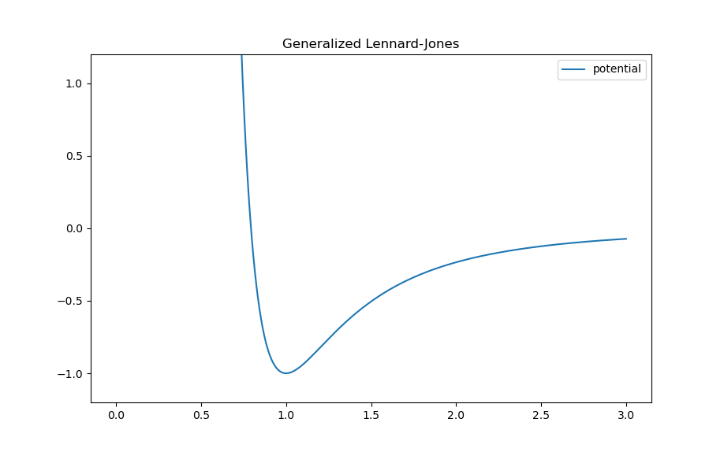

.. _potentials:

.. py:currentmodule:: tissue_forge

Potentials
-----------

One of the main goals of Tissue Forge is to enable users to rapidly develop and
explore empirical or phenomenological models of active and biological matter in
the 100nm to multiple cm range. Supporting modeling and simulation in these
ranges requires a good deal of flexibility to create and calibrate potential
functions to model material rheology and particle interactions.

Tissue Forge provides a wide range of potentials in the :py:class:`Potential` class.
Any of the built-in potential functions
can be created as objects in a simulation using a static method on the
:py:class:`Potential` class, which can be :ref:`bound <binding>` to pairs and
groups of particles to implement models of interactions.

Creating, Plotting and Exploring Potentials
^^^^^^^^^^^^^^^^^^^^^^^^^^^^^^^^^^^^^^^^^^^^

:py:class:`Potential` objects are created simply by calling one of the
static methods on the :py:class:`Potential` class. In Python, :py:class:`Potential`
objects conveniently have a :meth:`plot <Potential.plot>` method that displays a
graph of the potential energy in a ``matplotlib`` plot. For example, while working
with the built-in Generalized Lennard-Jones potential, ::

    import tissue_forge as tf
    pot = tf.Potential.glj(1)
    pot.plot(potential=True, force=False, ymin=-1, ymax=1)

results in 

A :py:class:`Potential` instance can also be created by adding two existing
instances. Such operations can be arbitrarily performed to construct complicated
potentials consisting of multiple constituent potentials, ::

    pot_charged = tf.Potential.coulomb(q=1)
    pot_fluid = tf.Potential.dpd(alpha=0.3, gamma=1, sigma=1, cutoff=0.6)
    pot_charged_fluid = pot_charged + pot_fluid

.. note::

    Changes to constituent potentials during simulation are reflected in potentials
    that have been constructed from them using summation operations.

Tissue Forge also supports creating custom potentials with the :py:class:`Potential` method
:meth:`custom <Potential.custom>`. A custom :py:class:`Potential` requires the domain
of the :py:class:`Potential` and, at minimum, a function that takes a float as argument and
returns the value of the :py:class:`Potential` at the argument value. Tissue Forge constructs
an interpolation of a potential function using functions that return the value of the
:py:class:`Potential`, its first derivative, and its sixth derivative. When a function is
not provided for either derivative, the derivative is approximated using finite difference, ::

    pot_custom = tf.Potential.custom(min=0.0, max=2.0,
                                     f=lambda r: (r-1.0) ** 6.0,            # Potential function
                                     fp=lambda r: 6.0 * (r-1.0) ** 5.0,     # First derivative
                                     f6p=lambda r: 720.0)                   # Sixth derivative

Potentials for :ref:`angle <bonded_interactions:Angles>` and
:ref:`dihedral <bonded_interactions:Dihedrals>` bonds can be created by passing
``Potential.Flags.angle.value`` and ``Potential.Flags.dihedral.value``, respectively
(``POTENTIAL_ANGLE`` and ``POTENTIAL_DIHEDRAL`` in C++, respectively), to
the keyword argument ``flags``. In both cases, the cosine of the angle of an angle or
dihedral bond is passed as argument to the potential function, ::

    pot_angle = tf.Potential.custom(min=-0.999, max=0.999,
                                    f=lambda r: cos(2.0 * acos(r)),
                                    flags=tf.Potential.Flags.angle.value)

.. note::

    The cosine of angles is used when evaluating angle and dihedral bonds to improve
    computational performance, but presents challenges to creating custom potentials in
    that analytic expressions for derivatives of the potential function can be excessively
    tedious to derive and implement. This issue motivates providing built-in support
    for approximating derivatives using finite difference. However, providing functions
    for the first and sixth derivative of a potential function is recommended whenever possible,
    as is examining the quality of the generated interpolation of a potential function before
    using it in a simulation using :meth:`plot <Potential.plot>`.

Built-in Potentials
^^^^^^^^^^^^^^^^^^^^

Presently, the following built-in potential functions are supported, with corresponding
constructor method. For details on the parameters of each function, refer to the
:ref:`Tissue Forge API Reference <api_reference>`.

* 12-6 Lennard-Jones: :meth:`Potential.lennard_jones_12_6 <Potential.lennard_jones_12_6>`
* 12-6 Lennard-Jones with shifted Coulomb: :meth:`Potential.lennard_jones_12_6_coulomb <Potential.lennard_jones_12_6_coulomb>`
* Coulomb: :meth:`Potential.coulomb <Potential.coulomb>`
* Coulomb reciprocal potential: :meth:`Potential.coulombR <Potential.coulombR>`
* Dissipative particle dynamics: :meth:`Potential.dpd <Potential.dpd>`
* Ewald (real-space): :meth:`Potential.ewald <Potential.ewald>`
* Generalized Lennard-Jones: :meth:`Potential.glj <Potential.glj>`
* Harmonic: :meth:`Potential.harmonic <Potential.harmonic>`
* Harmonic angle: :meth:`Potential.harmonic_angle <Potential.harmonic_angle>`
* Harmonic dihedral: :meth:`Potential.harmonic_dihedral <Potential.harmonic_dihedral>`
* Cosine dihedral: :meth:`Potential.cosine_dihedral <Potential.cosine_dihedral>`
* Linear: :meth:`Potential.linear <Potential.linear>`
* Morse: :meth:`Potential.morse <Potential.morse>`
* Overlapping sphere: :meth:`Potential.overlapping_sphere <Potential.overlapping_sphere>`
* Power: :meth:`Potential.power <Potential.power>`
* Well: :meth:`Potential.well <Potential.well>`

Shifted Potentials
^^^^^^^^^^^^^^^^^^^

Some potentials (*e.g.*, :meth:`morse <Potential.morse>`) provide default or optional
*shifted* forms. When a potential is shifted, the distance between two particles during
an interaction is shifted by the sum of radii of the two particles. For example, the two
following potentials produce the same potential, though only one uses shifting,

.. code:: python

    class PType(tf.ParticleTypeSpec):
        radius = 0.1
    ptype = PType.get()

    pot_shifted = tf.Potential.morse(min=-ptype.radius * 2, max=2 - ptype.radius * 2, r0=0)
    pot_noshift = tf.Potential.morse(min=0, max=2, r0=ptype.radius * 2, shifted=False)

Potential Details
^^^^^^^^^^^^^^^^^^

Most potentials define a range of distances over which two particles interact, which
Tissue Forge uses to construct an interpolation of the potential function for imposing
forces on interacting particles. As such, interpolated potentials cannot be altered once
they have been created, and so changing a potential during a simulation requires replacing the
potential with an updated version of itself. For potentials that are :ref:`bound<binding>` to pairs
of particles by type, performing binding replaces any potential that was previously bound to a
pair of particle types. For updating :ref:`bonded interactions<bonded_interactions>`, a bond
can simply be destroyed and recreated with the updated potential. Furthermore, potentials that use
interpolations are not defined outside of their prescribed range of distances. For the case of
two particles that are separated by a distance greater than the maximum distance of a potential range,
Tissue Forge simply ignores the potential (like the global :ref:`cutoff distance<cutoff_distance>`).
For the case of two particles that are separated by a distance less than the minimum distance of a
potential range, the magnitude of the resulting force at the minimum distance of the potential range
is applied.
