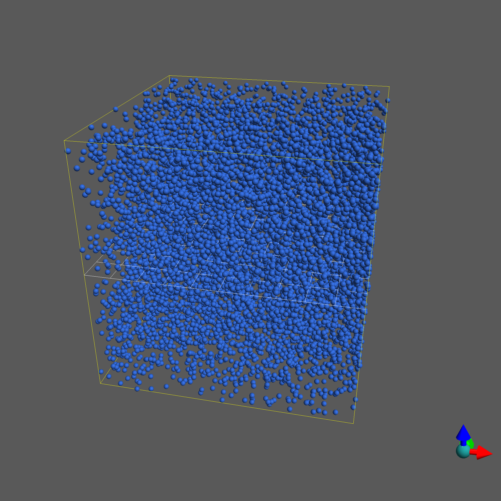

.. _quickstart:

.. py:currentmodule:: tissue_forge

Quickstart
===========

Python Quickstart
------------------

This example will create a complete simulation of a set of argon atoms in Python.
First we import Tissue Forge, and we will also use Numpy to create initial conditions::

    import tissue_forge as tf
    import numpy as np

We'll start by defining a variable that defines the size of the simulation domain.
Among many other ways to configure a simulation, we can specify the size of
the universe in a simulation using a list::

    # dimensions of universe
    dim = [10., 10., 10.]

The first thing we must always do before we create any Tissue Forge simulation object is
initialize Tissue Forge. This essentially sets up the simulation environment, and gives us a place
to create our model. ::

    tf.init(dim=dim)

A Tissue Forge particle type acts like a factory that creates particles according to its definition.
Tissue Forge provides more than one way to create a custom particle type. However, the
recommend method of designing a new particle type is to create a subclass of the Tissue Forge base
particle type specification :class:`ParticleTypeSpec` in Python, which Tissue Forge can use to
automatically create and register a particle type with whatever information is provided in
the specification (and default information otherwise). The Tissue Forge particle type
(and corresponding particles) contains a number of customizable attributes such as radius and mass. ::

    # create a particle type
    class ArgonType(tf.ParticleTypeSpec):
        mass = 39.4

A new, derived particle type must be registered with Tissue Forge before we can use it to create
particles. We can use the same class method to register and get our new particle type, and no matter
where we might be in a script, we can use the same class method to always get the instance of our
particle type that Tissue Forge is also using to simulate our model. ::

    # Register and get the particle type; registration always only occurs once
    Argon = ArgonType.get()

.. note::
    Particle types are not automatically registered with Tissue Forge in Python when simply instantiated.
    Tissue Forge follows this paradigm to facilitate model archiving and sharing, as well as basic
    model-specific operations that do not require simulation functionality.

Particles can interact via :class:`Potentials <Potential>`. Tissue Forge provides a variety of
built-in potentials, as well as the ability to create custom interactions. For now, we will use the
built-in Lennard-Jones 12-6 potential. All we have to do is create an instance of a potential and *bind*
it to objects that interact according to our model. To create a Lennard-Jones 12-6 potential, ::

    # create a potential representing a 12-6 Lennard-Jones potential
    pot = tf.Potential.lennard_jones_12_6(0.275, 3.0, 9.5075e-06, 6.1545e-03, 1.0e-3)

The total force on any object such as a particle is simply the sum of
all forces that act on that object. To make our potential describe an interaction force between
all particles of our new particle type, we *bind* our potential to our new type::

    # bind the potential with the *TYPES* of the particles
    tf.bind.types(pot, Argon, Argon)

.. note::
    ``Argon`` is passed as both the second and third arguments of :meth:`bind.types <bind.types>`
    because we are here describing an interaction between particles of two types. We could do the
    same to describe an interaction between ``Argon`` particles and particles of some other type that
    we might create.

To fill our simulation domain with particles at uniformly distributed random initial positions,
we can use a numpy random function to generate an array of positions::

    # uniform random cube
    positions = np.random.uniform(low=0, high=10, size=(10000, 3))

We then simply create a new particle at each of our positions using our new particle type. We can
create particles of our new particle type by using it like a function::

    for pos in positions:
        # calling the particle constructor implicitly adds
        # the particle to the universe
        Argon(pos)

Now all that's left is to run our simulation. The Tissue Forge Python module has two methods to
run a simulation: :func:`run` and :func:`irun`. The :func:`run` method runs the simulation, and
(if no final time is passed as argument) continues until the window is closed, or some stop condition.
If running Tissue Forge from `IPython`, the :func:`irun` method starts the simulation but leaves the console
open for further input, which Tissue Forge carries out as the simulation executes. ::

    # run the simulator interactively
    tf.irun()

Putting it all together looks something like the following.
The complete script can also be downloaded here:

Download: :download:`this example script <../../../py/examples/argon.py>`::

    import tissue_forge as tf
    import numpy as np

    # dimensions of universe
    dim = [10., 10., 10.]

    # new simulator
    tf.init(dim=dim)

    # create a potential representing a 12-6 Lennard-Jones potential
    pot = tf.Potential.lennard_jones_12_6(0.275, 3.0, 9.5075e-06, 6.1545e-03, 1.0e-3)

    # create a particle type
    class ArgonType(tf.ParticleTypeSpec):
        radius = 0.1
        mass = 39.4

    # Register and get the particle type; registration always only occurs once
    Argon = ArgonType.get()

    # bind the potential with the *TYPES* of the particles
    tf.bind.types(pot, Argon, Argon)

    # uniform random cube
    positions = np.random.uniform(low=0, high=10, size=(10000, 3))

    for pos in positions:
        # calling the particle constructor implicitly adds
        # the particle to the universe
        Argon(pos)

    # run the simulator interactive
    tf.run()

C++ Quickstart
---------------

This example will create a complete simulation of a set of argon atoms in C++ that can be compiled into
an executable program. First, we create a basic skeleton of an entry point and simulation function.

.. code-block:: cpp

    int quickstart() {
        return 0;
    }

    int main (int argc, char** argv) {
        return quickstart();
    }

The entire Tissue Forge runtime interface can be imported through `TissueForge.h`, and all
Tissue Forge features are defined in the ``TissueForge`` namespace.
We add at the top of our script:

.. code-block:: cpp

    #include <TissueForge.h>

    using namespace TissueForge;

Among many other ways to configure a simulation, we can specify the size of
the universe in a simulation using a ``Simulator::Config`` object.
We begin our ``quickstart`` function:

.. code-block:: cpp

    Simulator::Config config;
    config.universeConfig.dim = {10., 10., 10.};

The first thing we must always do before we create any Tissue Forge simulation object is
initialize Tissue Forge. This essentially sets up the simulation environment, and gives us a place
to create our model. We add to the end of our ``quickstart`` function,

.. code-block:: cpp

    init(config);

A Tissue Forge particle type acts like a factory that creates particles according to its definition.
Tissue Forge provides more than one way to create a custom particle type. However, the
recommend method of designing a new particle type is to create a subclass of the Tissue Forge base
particle type (``ParticleType`` in C++). The Tissue Forge particle type (and corresponding particles)
contains a number of customizable attributes such as radius and mass.
We add before our ``quickstart`` function the definition of our new particle type:

.. code-block:: cpp

    struct ArgonType : ParticleType {
        ArgonType() : ParticleType(true) {
            radius = 0.1;
            mass = 39.4;
            registerType();
        }
    };

A new, derived particle type must be registered with Tissue Forge before we can use it to create
particles. We can use the same class method to register and get our new particle type, and no matter
where we might be in a script, we can use the same class method to always get the instance of our
particle type that Tissue Forge is also using to simulate our model.
We add to the end of our ``quickstart`` function,

.. code-block:: cpp

    ArgonType *Argon = new ArgonType();
    Argon = (ArgonType*)Argon->get();

.. note::
    Particle types are not automatically registered with Tissue Forge in C++ when instantiated with a
    ``true`` argument. Tissue Forge permits this functionality to facilitate model archiving and sharing,
    as well as basic model-specific operations that do not require simulation functionality.

Particles can interact via ``Potentials``. Tissue Forge provides a variety of
built-in potentials, as well as the ability to create custom interactions. For now, we will use the
built-in Lennard-Jones 12-6 potential. All we have to do is create an instance of a potential
and *bind* it to objects that interact according to our model.
To create a Lennard-Jones 12-6 potential, we add to the end of our ``quickstart`` function,

.. code-block:: cpp

    Potential *pot = Potential::lennard_jones_12_6(0.275, 3.0, 9.5075e-06 , 6.1545e-03 , new FloatP_t(1.0e-3));

Here we employ the ``FloatP_t`` type, which is a floating-point precision type according to the
precision of the Tissue Forge installation (default single-precision).

The total force on any object such as a particle is simply the sum of
all forces that act on that object. To make our potential describe an interaction force between
all particles of our new particle type, we *bind* our potential to our new type.
We add to the end of our ``quickstart`` function,

.. code-block:: cpp

    bind::types(pot, Argon, Argon);

.. note::
    ``Argon`` is passed as both the second and third arguments of ``bind::types`` because
    we are here describing an interaction between particles of two types. We could do the
    same to describe an interaction between ``Argon`` particles and particles of some other type that
    we might create.

To fill our simulation domain with particles at uniformly distributed random initial positions,
we can use a Tissue Forge function that generates an array of positions in a
unit cube centered at the origin.
We add to the end of our ``quickstart`` function,

.. code-block:: cpp

    std::vector<FVector3> positions = randomPoints(PointsType::SolidCube, 10000);

We then simply create a new particle at each of our positions using our new particle type. We can
create particles of our new particle type by using it like a function.
We add to the end of our ``quickstart`` function,

.. code-block:: cpp

    for(auto &p : positions) {
        FVector3 partPos = (p + FVector3(0.5)) * 10.0;
        (*Argon)(&partPos);
    }

Now all that's left is to run our simulation. The Tissue Forge namespace has a method ``run``
that runs the simulation, and (if no argument is passed) continues until the window is
closed, or some stop condition.
We add to the end of our ``quickstart`` function,

.. code-block:: cpp

    run();

Putting it all together looks something like the following:

.. code-block:: cpp

    #include <TissueForge.h>

    using namespace TissueForge;

    struct ArgonType : ParticleType {
        ArgonType() : ParticleType(true) {
            radius = 0.1;
            mass = 39.4;
            registerType();
        }
    };

    int quickstart() {
        Simulator::Config config;
        config.universeConfig.dim = {10., 10., 10.};
        init(config);

        ArgonType *Argon = new ArgonType();
        Argon = (ArgonType*)Argon->get();

        Potential *pot = Potential::lennard_jones_12_6(0.275, 3.0, 9.5075e-06 , 6.1545e-03 , new FloatP_t(1.0e-3));
        bind::types(pot, Argon, Argon);

        std::vector<FVector3> positions = randomPoints(PointsType::SolidCube, 10000);

        for(auto &p : positions) {
            FVector3 partPos = (p + FVector3(0.5)) * 10.0;
            (*Argon)(&partPos);
        }

        run();

        return 0;
    }

    int main (int argc, char** argv) {
        return quickstart();
    }

    A basic argon simulation
